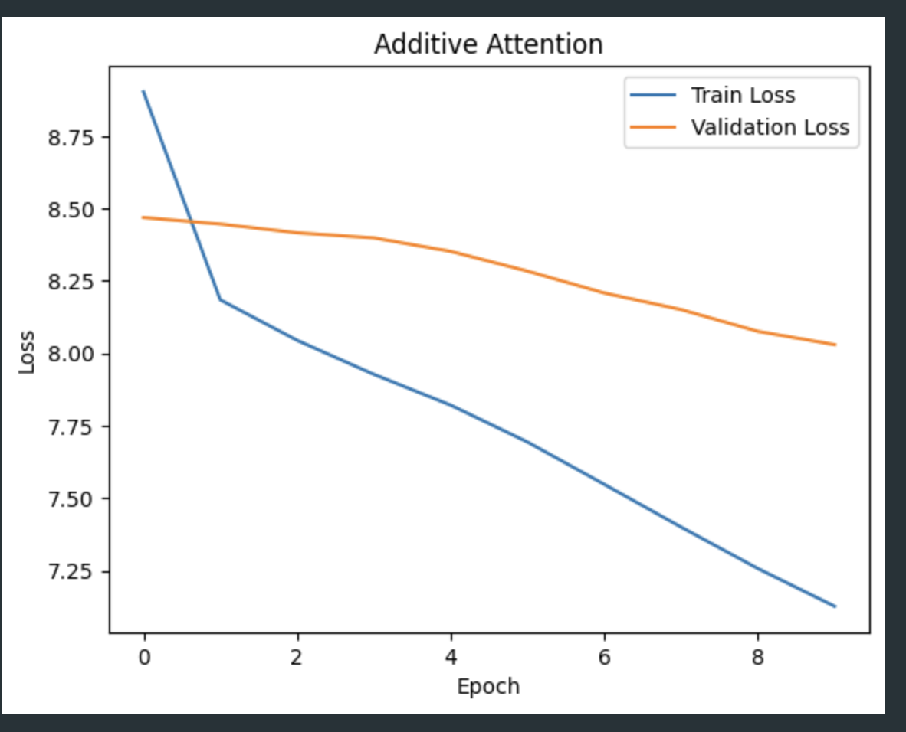
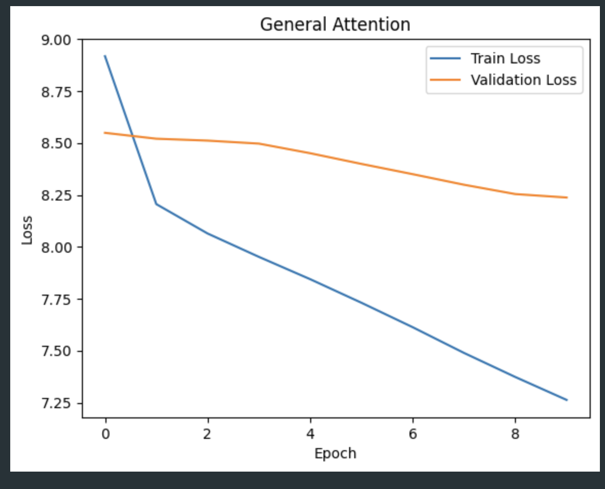
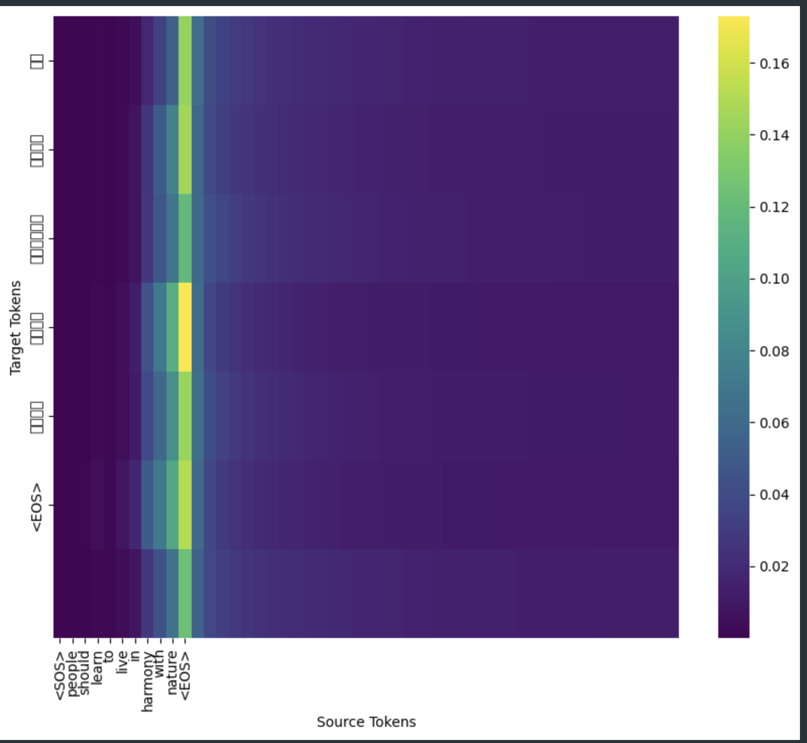
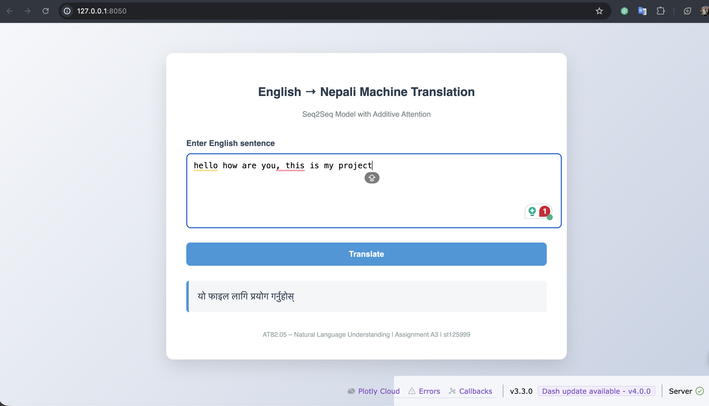

# Assignment A3: Make Your Own Machine Translation Language  
## AT82.05 – Artificial Intelligence: Natural Language Understanding (NLU)

## Overview

This assignment explores **Neural Machine Translation (NMT)** using a **sequence-to-sequence (Seq2Seq)** architecture with attention mechanisms. The goal is to translate between **English and Nepali**, evaluate different attention mechanisms, and deploy the best-performing model in a simple web application.

The assignment focuses on:

- Dataset preparation and preprocessing  
- Implementing and comparing attention mechanisms  
- Evaluating model performance and interpretability  
- Deploying a trained translation model as a web application  

---

## Task 1: Dataset Selection & Preparation :

### 1. Dataset - 

* Dataset Name: English–Nepali Parallel Corpus

* Source: HuggingFace Datasets

* Link: https://huggingface.co/datasets/CohleM/english-to-nepali

* Number of Sentence Pairs: ~177,000 (subsampled for training efficiency)

* License: As provided by the dataset author on HuggingFace

Justification:

This dataset provides high-quality aligned English–Nepali sentence pairs required for supervised Seq2Seq-based Neural Machine Translation. It is distributed through HuggingFace Datasets, a widely used and trusted academic and industrial machine learning platform that hosts peer-reviewed and community-curated datasets. The parallel structure of the corpus enables effective learning of source–target mappings and attention-based alignments. In addition, the dataset covers a diverse range of sentence structures and vocabulary, which helps the model generalize beyond simple phrase-level translation. Its public availability, clear documentation, and prior usage in multilingual NLP research make it a reliable and appropriate choice for experimenting with attention mechanisms in English–Nepali machine translation.

### 2. Data Preprocessing

The following preprocessing steps were applied :

1.Text Normalization

2.Lowercasing English text

3.Removing extra whitespace

4.Unicode-safe handling for Nepali text

5.Tokenization

6.English: whitespace-based tokenization

7.Nepali: whitespace tokenization (sufficient for this dataset)

8.Special Tokens :

PAD : padding

SOS : start of sentence

EOS : end of sentence

UNK : unknown token

9.Vocabulary Construction : 

Separate vocabularies for source (English) and target (Nepali),Token-to-index and index-to-token mappings created

10.Padding & Truncation

All sequences padded/truncated to a fixed maximum length

11.Libraries Used

* datasets (HuggingFace)

* torch

* re (text normalization)

## Task 2: Experiment with Attention Mechanisms

A Seq2Seq neural network with an LSTM encoder and decoder was implemented. Two attention mechanisms were evaluated.

1. General Attention

    * Uses dot-product similarity between decoder state and encoder states,Computationally efficient,Requires equal dimensionality

2. Additive Attention
     
     * Uses learnable parameters,More expressive due to non-linear transformation,Better suited for complex alignments

Both mechanisms were implemented and trained under identical conditions.

## Task 3: Evaluation & Verification

### 1. Performance Comparison

The models were evaluated using:

Training Loss

Validation Loss

Perplexity (PPL)

Training time (qualitative comparison) :

| Attention Type     | Training Loss | Training PPL | Validation Loss | Validation PPL |
| ------------------ | ------------- | ------------ | --------------- | -------------- |
| General Attention  | 7.2628        | 1426.27      | 8.2373          | 3779.43        |
| Additive Attention | 7.1269        | 1245.03      | 8.0299          | 3071.54        |

### 2. Loss Curves

Training and validation loss curves were plotted for both attention mechanisms.

   

3. Attention Maps

Attention maps were visualized as heatmaps showing alignment between source and target tokens during translation.

  

These maps provide interpretability by highlighting which source words the model focuses on while generating each target word.

### 4. Analysis

In this experiment, both General Attention and Additive Attention models were evaluated on the English–Nepali translation task using a larger training set and multiple epochs. Across all epochs, both models showed a steady decrease in training loss, indicating effective learning. However, the Additive Attention model consistently outperformed the General Attention model in terms of validation performance. By the final epoch, Additive Attention achieved a lower validation loss (approximately 8.03) and validation perplexity (around 3071) compared to General Attention, which exhibited a higher validation loss (approximately 8.24) and perplexity (around 3779). Although General Attention is computationally more efficient due to its simple dot-product formulation, it is less expressive in modeling complex alignments. Additive Attention, which incorporates learnable parameters and a non-linear combination of encoder and decoder states, is better able to capture richer source–target relationships. This advantage is particularly important for English–Nepali translation, as Nepali is a morphologically rich language with flexible word order. The attention heatmaps further support this conclusion, showing clearer and more focused alignment patterns in the Additive Attention model. Based on both quantitative metrics and qualitative attention visualization, Additive Attention was selected as the final model for deployment.

## Task 4: Web Application Development

A web application was developed using Dash to demonstrate real-time English–Nepali machine translation.

Application Features :

* Text input box for English sentences,Translate button to trigger inference,Display of generated Nepali translation

Model–App Interface Documentation :

The web application integrates the trained Seq2Seq model with Additive Attention by loading the model parameters and the corresponding source and target vocabularies once during application startup. When a user enters an English sentence, the input text is first normalized and tokenized, after which each token is converted into its numerical representation using the source vocabulary. This numerical sequence is then passed through the encoder, which generates contextual representations of the input sentence. During decoding, the Additive Attention mechanism dynamically computes alignment weights between the encoder outputs and the current decoder state, allowing the model to focus on the most relevant source words while generating each Nepali token. The decoder continues this process step-by-step until an end-of-sentence token is produced. Finally, the predicted token indices are converted back into readable Nepali words and displayed on the web interface. By loading the model only once and reusing it for all user requests, the application ensures efficient and responsive inference.

App Interface

  

  

[<video controls src="file:///Users/kharelanubhav/Desktop/A3_NLP/App/images/app.mp4" title="Title"></video>](https://github.com/aKayy369/A3_NLP/issues/1)

Running the App :

cd app
python app.py

